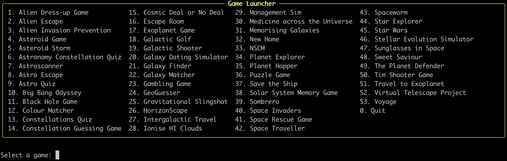
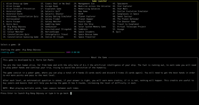
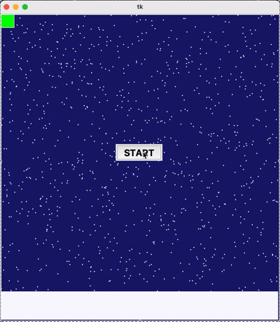

# Astronomy Game Project

Welcome to the **Astronomy Game Project**! 🚀

This repository is a project as part of the first-year programming course for Astronomy major. It features a collection of games developed by amazing first-year students at the [Kapteyn Astronomical Institute](https://www.rug.nl/research/kapteyn/?lang=en), University of Groningen (Netherlands). A full list of these creators is provided at the bottom of the page.

Please note that some games may take a little time to load. In addition, a few games may not close the game window or unintentionally close the launcher when the game ends, due to the way they were programmed. Please also be aware that, in some unfortunate cases, games may not function as intended. If this happens, simply close the window manually and/or restart the launcher to continue trying other games. 

Most importantly, please remember that these projects were created as part of a fun first-year assignment. We hope you enjoy playing them as much as the students enjoyed creating them! :-)

### How to play?
Download the repository, move to the repository, and run the following command in your terminal to launch the game menu:
```python
python launcher.py
```
You will then see the game launcher interface. 



Enter the number corresponding to the game you would like to play and enjoy!


### Requirement

All games in this repository are developed in Python. Students were given complete creative freedom in designing their games, provided that each project uses at least one real astronomical data, which can be images, spectra, or tabular datasets. As a result, some games may require additional Python packages to run properly.

#### Basic
- NumPy
- AstroPy
- Matplotlib
- Pandas

#### Additional for some games
- [pygame](https://www.pygame.org/wiki/GettingStarted)
- [arcade](https://api.arcade.academy/en/3.3.3/get_started/install.html): very few games require.
- [tabulate](https://pypi.org/project/tabulate/): very few games require.

# Demo Examples

#### Game 10: Big Bang Odyssey 


#### Game 43: Spaceworm 



---
# Credits 

Thanks to all the creators for their efforts. The names are listed in alphabetical order by surname.

*J. Alberda, D. Alvarez Corres, S. Arentsen, O. Assenberg, H. Atela Gonzalez, M. Bakelaar, B. Balas, T. Balvin, E. Bartucz, S. Bazigos, M. Boer, L. Burgos Ballester, V. Calvo Tenza, B. Chylinska, N. Demmenie, B. Dobak, C. Eshuis, I. Figueiro, B. Flikkema, I. Frank, M. Gerritsen, K. Godzieba, S. Haag, G. Harlaar, A. Hofman, A. Hreniuc, S. Huijbers, L. Jawinski, G. Ketchum, S. Kiewiet, L. Klingens, S. Kokkola, N. Kuizenga, N. Krosse, M. Lavik, S. Leszek, I. Mazzei Braschi, D. Meindertsma, Y. Mesu, L. Mispelaar, W. Oosterhof, A. Pafitis, G. Parra San Pedro, M. Rosberg, N. Stephen, A. Stroeve, L. Suberbere, A. Tarzian, A. Valmana Perez, A. Vecht, M. Weeren, J. Whibley, S. Zhou*


